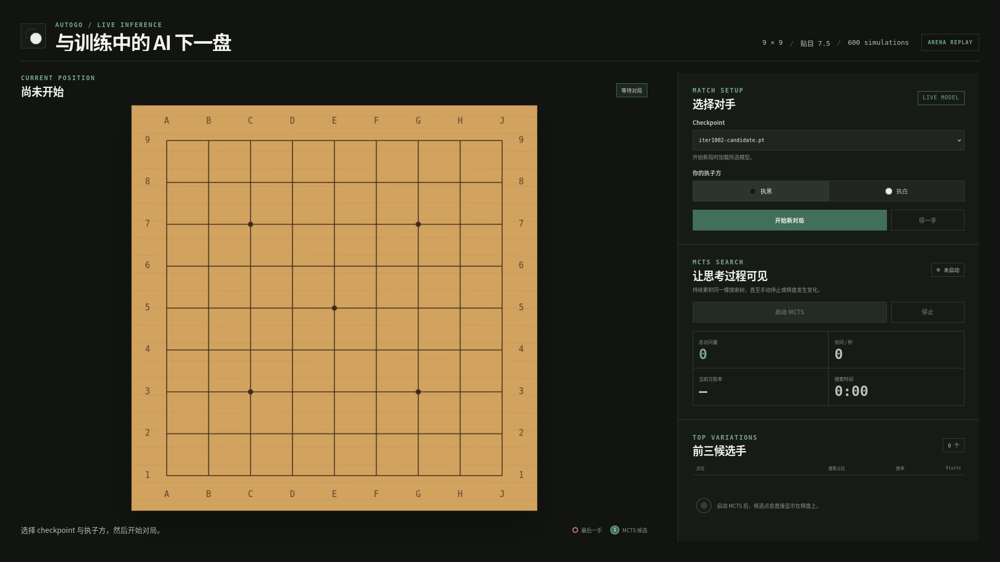

# AutoGo-conda

一个可直接在 Conda 环境中安装和运行的围棋 AI 训练框架。仓库保留 AutoGo 的
Python/C++ 核心、完整的 `Self-play -> Train -> Arena -> Promote/Reject` 实验控制器、
一个经过实战训练的 9x9 champion，以及可视化 MCTS 搜索的人机对弈界面。



## 仓库内容

- `src/alpha_go/`：围棋规则、神经网络、MCTS、自对弈与推理代码。
- `src/alpha_go/cpp/`：C++17 围棋规则和批量 MCTS，通过 pybind11 暴露给 Python。
- `experiments/2026-07-31_11-39-local-9x9-k7-pcr-001/`：9x9 PCR 自对弈、DDP 训练、Arena 晋级和状态监控代码。
- `local_data/checkpoints/.../iter1002-candidate.pt`：当前打包的正式 champion。
- `checkpoint_play/`：人机对弈、持续 MCTS 可视化和两局 Arena 棋谱回放。
- `tests/`：核心 Python/C++ 规则、MCTS、模型和数据测试。

实验原始目录约 15 GB。本仓库只保留可复现代码、最终配置、champion 和演示所需的
两局小型 NPZ 棋谱；训练缓存、历史 candidate、日志、manifest 和旧 runtime 状态均未打包。

## Conda 安装

需要 Linux、Conda、支持 PyTorch 的 NVIDIA 驱动，以及足够的磁盘空间。自动安装：

```bash
git clone https://github.com/JoeyJin-NJU/AutoGo-conda.git
cd AutoGo-conda
bash scripts/setup_conda.sh
conda activate autogo-conda
```

也可以逐步执行：

```bash
conda env create -f environment.yml
conda activate autogo-conda
python -m pip install --editable '.[dev]'
bash scripts/build_cpp.sh
python scripts/verify_install.py
```

`build_cpp.sh` 使用当前 Conda 环境中的 Python、CMake 和 Ninja 编译 `alpha_go_cpp`，
不依赖 `uv`、Docker 或固定的服务器路径。

## 验证

```bash
python scripts/verify_install.py
pytest -q tests
pytest -q experiments/2026-07-31_11-39-local-9x9-k7-pcr-001/test_experiment.py \
  experiments/2026-07-31_11-39-local-9x9-k7-pcr-001/test_packed_dataset.py
```

## 启动对弈界面

```bash
conda activate autogo-conda
CUDA_VISIBLE_DEVICES=0 python checkpoint_play/app.py --host 127.0.0.1 --port 8000
```

浏览器打开：

- `http://127.0.0.1:8000/`：完整人机对弈与持续 MCTS 分析界面。
- `http://127.0.0.1:8000/ppt`：适合投影的 16:9 演示界面。
- `http://127.0.0.1:8000/replay`：iter152 对 KataGo 的两局 Arena 回放。

模型正式落子使用 600 次 MCTS simulations；持续分析模式会在同一棵搜索树上继续累积
visits，直到手动停止或局面变化。

## 运行训练框架

打包实验默认保留原训练配置中的物理 GPU `2,3,4,5`。运行前请按机器实际情况同时修改
`config.json` 内 `collection.gpu_ids`、`training.gpu_ids` 和 `arena.gpu_ids`；全局 batch size
必须能被训练 GPU 数整除。

```bash
EXP=experiments/2026-07-31_11-39-local-9x9-k7-pcr-001

# 前台启动；第一次启动会校验并冻结打包的 iter1002 champion，随后从新 iteration 1 开始
bash "$EXP/launcher.sh"

# 查看状态
python "$EXP/status.py"

# 安全停止；当前原子阶段结束后不再调度新工作
bash "$EXP/stop.sh"

# 恢复同一运行
bash "$EXP/launcher.sh" --resume
```

这是一个以 `iter1002` 为 warm start 的新发布谱系，不包含原服务器上恢复 iteration 1003
所需的 15 GB 累积自对弈数据。新的数据、checkpoint、日志和 runtime 状态会分别写入
`local_data/` 与实验目录，并由 `.gitignore` 排除。

## Champion

| 字段 | 值 |
|---|---|
| Checkpoint | `iter1002-candidate.pt` |
| 参数量 | 2,967,683 |
| 棋盘 / 贴目 | 9x9 / 7.5 |
| 晋级时间 | 2026-08-13 06:56:05 UTC |
| Arena score | 0.5154639175 |
| SHA-256 | `3bd995e19240b7d2e6511cbdba5a94b381c01a910ed974e97011704541b9467f` |

该文件约 35.8 MB，低于 GitHub 单文件 100 MB 限制，因此不要求 Git LFS。

## 许可与来源

项目按 MIT License 发布。核心代码来源、快照 revision 和模型来源记录见
[`NOTICE.md`](NOTICE.md)。
